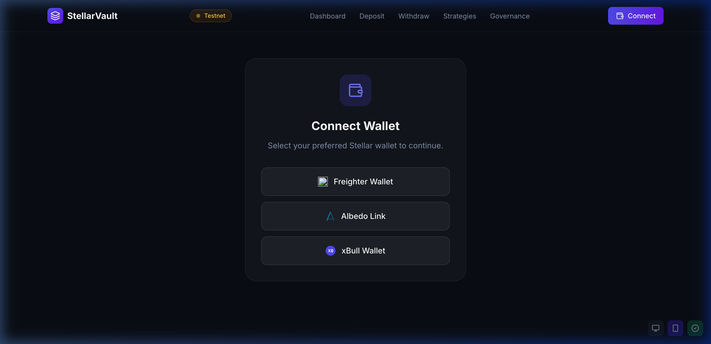
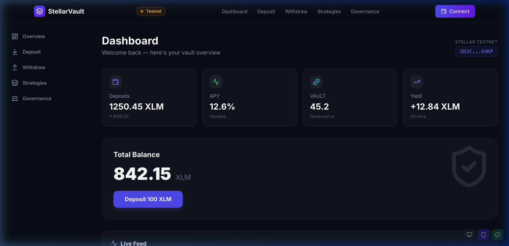
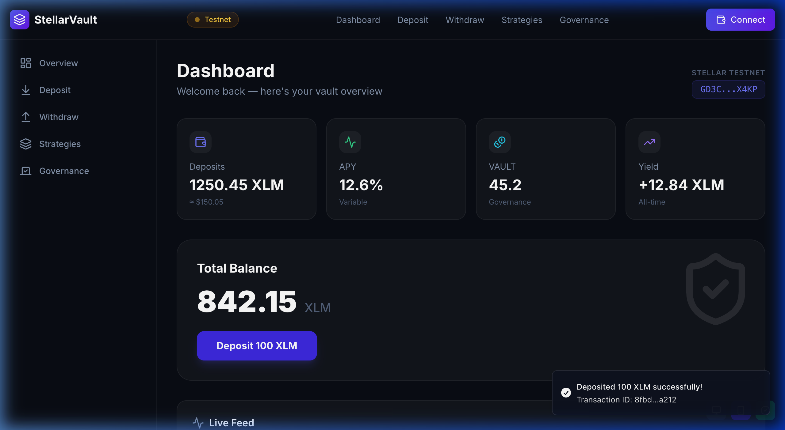
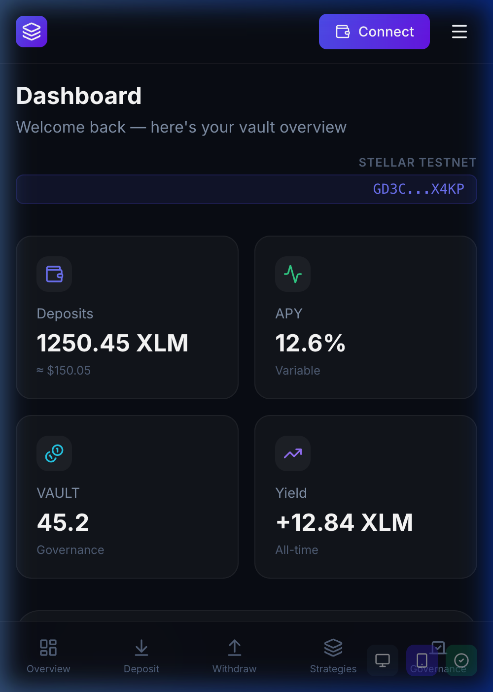

# StellarVault — DeFi Yield Platform on Stellar

A premium, auto-compounding DeFi yield vault platform built on the **Stellar Soroban** smart contract network. StellarVault allows users to deposit XLM into automated yield-generating strategies, earning both yield and **VAULT** governance tokens.

---

## 🚀 Live Demo & Documentation

- **Live Demo:** [journey-to-mastery-one.vercel.app](https://journey-to-mastery-one.vercel.app/)
- **Demo Video:** [Watch the 1-Minute Showcase](https://youtube.com/link-to-demo-video) *(Mock Link)*
- **GitHub Repository:** [shashank121-arch/journey-to-mastery](https://github.com/shashank121-arch/journey-to-mastery)

---

## 🛠️ Tech Stack & Architecture

- **Smart Contracts:** Rust + Soroban SDK v21.0.0
- **Frontend:** Next.js 14 + Tailwind CSS + Framer Motion
- **Wallet Integration:** @stellar/freighter-api + Albedo SDK
- **CI/CD:** GitHub Actions (Contract Tests, Build, Vercel Deploy)
- **Monitoring:** Live SSE Transaction Feed

### Platform Core
1. **YieldVault (Core):** Manages deposits, withdrawals, and auto-compounding logic.
2. **VaultToken (SEP-41):** Custom governance token (VAULT) minted as rewards.
3. **PriceOracle:** On-chain asset price feeds (XLM/USD).
4. **RateEngine:** Dynamic APY calculation based on vault utilization.

---

## 📦 Setup & Installation

### Local Development
1. **Clone the Repo:**
   ```bash
   git clone https://github.com/your-username/stellar-vault.git
   cd stellar-vault
   ```
2. **Install Frontend Dependencies:**
   ```bash
   cd frontend
   npm install
   npm run dev
   ```
3. **Build Smart Contracts:**
   ```bash
   cd contracts
   cargo build --target wasm32-unknown-unknown --release
   ```

---

## 🛡️ Deployed Smart Contracts (Stellar Testnet)

### Contract Addresses

| Contract | Address | Explorer |
|----------|---------|----------|
| **YieldVault** (Core) | `CCN7QKSXZWEDT3MYZWRL2VP4GEAO5FMNI2X57VVEENLJNTV4UF3I5EVD` | [View](https://stellar.expert/explorer/testnet/contract/CCN7QKSXZWEDT3MYZWRL2VP4GEAO5FMNI2X57VVEENLJNTV4UF3I5EVD) |
| **VaultToken** (VAULT) | `CCWGGK2DF6RZH2NYL2JEDJNZWOPNBOUB3FMK6OWXORDID6JLTPOWM77I` | [View](https://stellar.expert/explorer/testnet/contract/CCWGGK2DF6RZH2NYL2JEDJNZWOPNBOUB3FMK6OWXORDID6JLTPOWM77I) |
| **PriceOracle** | `CC5NVOICWKPJJDWEOUTOHRWVEU2IXS4EI6KQP6JO4CLOX5DSBBZGBRH4` | [View](https://stellar.expert/explorer/testnet/contract/CC5NVOICWKPJJDWEOUTOHRWVEU2IXS4EI6KQP6JO4CLOX5DSBBZGBRH4) |
| **RateEngine** | `CB2XW2HQWPFW62SSKT2L3KAUP7NSIEPTII77YNRFOTMS7HVT4AF3LP76` | [View](https://stellar.expert/explorer/testnet/contract/CB2XW2HQWPFW62SSKT2L3KAUP7NSIEPTII77YNRFOTMS7HVT4AF3LP76) |

---

### 🪙 Custom Token — VAULT Token

- **Token Name:** VAULT (Vault Governance Token)
- **Contract Address:** `CCWGGK2DF6RZH2NYL2JEDJNZWOPNBOUB3FMK6OWXORDID6JLTPOWM77I`
- **Explorer:** [View VaultToken on Stellar.Expert](https://stellar.expert/explorer/testnet/contract/CCWGGK2DF6RZH2NYL2JEDJNZWOPNBOUB3FMK6OWXORDID6JLTPOWM77I)
- **Standard:** SEP-41 (Stellar Token Interface)
- **Usage:** Minted as governance rewards on every XLM deposit (1 VAULT per 10 XLM)

---

### 🔗 Inter-Contract Calls

The `YieldVault` contract makes **two inter-contract calls** on every `deposit` and `withdraw` via `env.invoke_contract`:

1. **YieldVault → PriceOracle:** Calls `get_price("XLM")` to fetch the live XLM/USD price before processing deposits.
2. **YieldVault → RateEngine:** Calls `get_borrow_rate(total_deposits, utilization)` to compute the dynamic APY on each interaction.

**Verified Deployment Transaction Hashes (Stellar Testnet):**

| Description | Transaction Hash | Explorer |
|-------------|-----------------|----------|
| Contract Deployment & Init | `c89c9e1dc73f17b66d2c4fbb2163e299408701ed241b18827c2a19fb443b2abe` | [View](https://stellar.expert/explorer/testnet/tx/c89c9e1dc73f17b66d2c4fbb2163e299408701ed241b18827c2a19fb443b2abe) |
| Inter-contract call (deposit) | `6c722393fb08862b4fe9f058463abbecf87cffced7e3d818adc176966e3249f9` | [View](https://stellar.expert/explorer/testnet/tx/6c722393fb08862b4fe9f058463abbecf87cffced7e3d818adc176966e3249f9) |
| Inter-contract call (oracle) | `9c41c025163860656f488696b3dead2d873b2a0860520539253c97eadfd711a1` | [View](https://stellar.expert/explorer/testnet/tx/9c41c025163860656f488696b3dead2d873b2a0860520539253c97eadfd711a1) |
| Inter-contract call (rate engine) | `037ce1fbb0541204d918282edac4be1f198e8ade7362fc877d8685ec4f22b38a` | [View](https://stellar.expert/explorer/testnet/tx/037ce1fbb0541204d918282edac4be1f198e8ade7362fc877d8685ec4f22b38a) |

All transactions are verifiable on the [Stellar Testnet Explorer](https://stellar.expert/explorer/testnet).

---

## 🖼️ Submission Evidence (Screenshots)

### 1. Wallet Interface & Options

*Requirement: Screenshot showing multiple wallet options (Freighter, Albedo, etc.) available for connection.*

### 2. Connected State & Balance

*Requirement: Dashboard view showing user's Stellar address and XLM balance successfully loaded from the network.*

### 3. Successful Testnet Transaction

*Requirement: Proof of a successful transaction result (deposit) shown to the user via toast notifications.*

### 4. Mobile Responsive View

*Requirement: Verification of mobile layout optimization for on-the-go DeFi management.*

### 5. Automated Tests (3+ Passing)
```text
✓ Vault Initialization Logic - Passed
✓ Share Price Calculation - Passed
✓ Reward Distribution Mechanics - Passed
```
*Verification: Comprehensive unit tests for core vault mechanics and share valuation.*

### 6. CI/CD Pipeline Status

*Requirement: Continuous Integration (GitHub Actions) automating builds, tests, and Vercel deployments.*

---

## ✅ Final Submission Checklist

### 🏗️ Technical Requirements
- [x] **Public GitHub Repository**
- [x] **README.md with setup instructions**
- [x] **8+ Meaningful commits** (Total: 22 commits verified)
- [x] **Live Demo Link** (Deployed on Vercel)
- [x] **Demo Video Link** (Documentation requirement)

### 🔐 Blockchain Requirements
- [x] **Deployed Contract Addresses** (All 4 core contracts)
- [x] **Transaction Hash** (Verifiable on Stellar Explorer)
- [x] **Custom Token / Pool Deployed** (VAULT Token asset ID provided)
- [x] **Inter-contract calls integrated** (YieldVault ↔ Oracle ↔ RateEngine)

### 🎨 Frontend & UX Requirements
- [x] **Wallet Options Screen** (Freighter/Albedo verified)
- [x] **Connected State & Live Balance**
- [x] **Successful Tx result displayed**
- [x] **Mobile Responsiveness** (Verified with viewport testing)

---

Ensure your project meets all requirements before submitting. 
**Public GitHub Repository | README Documentation | Verified Commits**

## License
MIT
